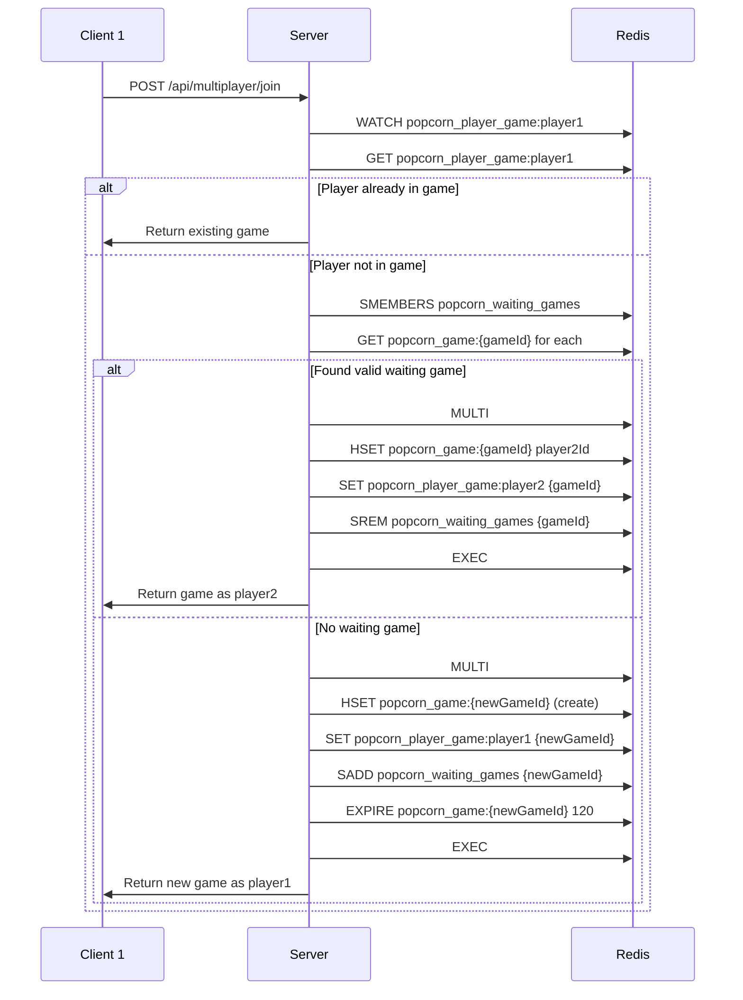
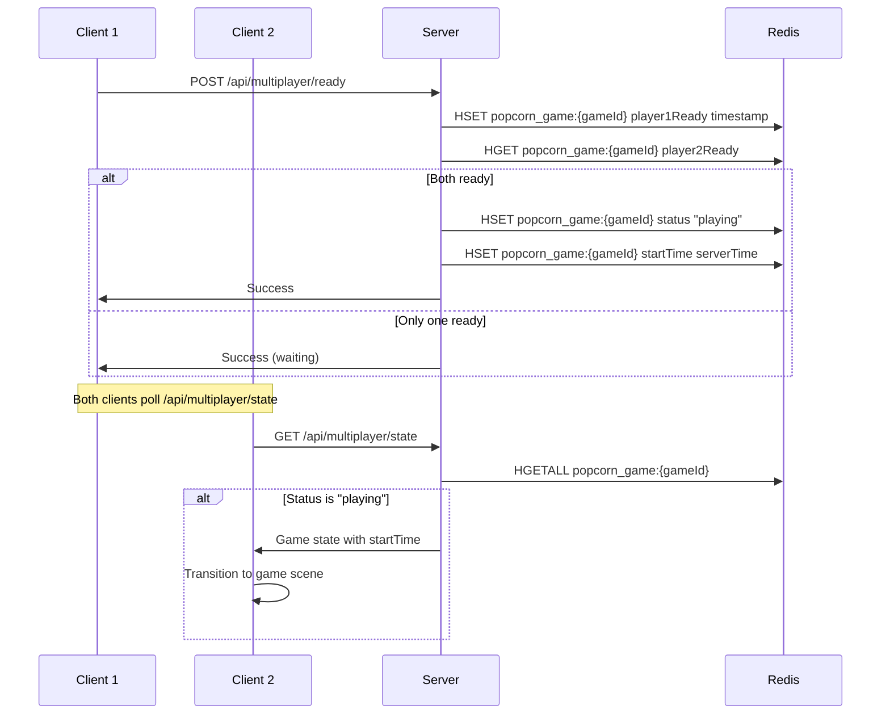

# Design Document

## Overview

This design document outlines the architecture for a robust cloud-based multiplayer backend system for a 2-player popcorn catching game on Reddit's Devvit platform. The system addresses critical issues in the current implementation including race conditions, duplicate joins, stale game cleanup, and disconnection handling.

### Current Implementation Issues

The existing multiplayer system has several critical flaws:

1. **No atomic operations**: Multiple players can join simultaneously causing race conditions
2. **No self-join prevention**: Players can match with themselves
3. **No ready state**: Games start immediately without both players confirming
4. **Poor cleanup**: Old games accumulate in Redis with non-zero scores
5. **No expiry**: Games never auto-expire, wasting resources
6. **Slow disconnect detection**: Takes 1.6+ seconds to detect disconnections
7. **No synchronized timers**: Clients use local time causing desync
8. **Resource leaks**: Polling intervals not properly cleaned up on scene exit

### Design Goals

- Prevent all race conditions using Redis atomic operations
- Ensure fair matchmaking with no duplicates or self-matching
- Implement ready state with 30-second timeout
- Auto-expire games after 2 minutes
- Detect disconnections within 3 seconds
- Provide synchronized server-based countdown timers
- Ensure proper cleanup of client-side resources

## Architecture

### System Components

```
┌─────────────────────────────────────────────────────────────┐
│                     Client (Phaser.js)                      │
│  ┌──────────────────┐         ┌──────────────────┐         │
│  │ MultiplayerLobby │────────▶│ MultiplayerGame  │         │
│  │  - Join/Leave    │         │  - Gameplay      │         │
│  │  - Ready State   │         │  - Position Sync │         │
│  │  - Polling       │         │  - Score Updates │         │
│  └──────────────────┘         └──────────────────┘         │
└─────────────────────────────────────────────────────────────┘
                           │
                           │ REST API (/api/multiplayer/*)
                           ▼
┌─────────────────────────────────────────────────────────────┐
│                    Server (Express.js)                      │
│  ┌──────────────────────────────────────────────────────┐  │
│  │         MultiplayerGameManager (Singleton)           │  │
│  │  - joinGame()      - leaveGame()                     │  │
│  │  - sendReady()     - getGameState()                  │  │
│  │  - updatePosition()- updateScore()                   │  │
│  │  - cleanupExpired()- detectDisconnect()              │  │
│  └──────────────────────────────────────────────────────┘  │
└─────────────────────────────────────────────────────────────┘
                           │
                           │ Redis Commands
                           ▼
┌─────────────────────────────────────────────────────────────┐
│                      Redis Database                         │
│  ┌────────────────────────────────────────────────────┐    │
│  │ Game Sessions (Hash)                               │    │
│  │  - popcorn_game:{gameId}                           │    │
│  │    • status: waiting | ready | playing | finished  │    │
│  │    • player1Id, player2Id                          │    │
│  │    • player1Ready, player2Ready (timestamps)       │    │
│  │    • lastActivity1, lastActivity2 (timestamps)     │    │
│  │    • startTime (server timestamp)                  │    │
│  │    • createdAt (for expiry)                        │    │
│  │    • TTL: 120 seconds                              │    │
│  └────────────────────────────────────────────────────┘    │
│  ┌────────────────────────────────────────────────────┐    │
│  │ Matchmaking Queue (Set)                            │    │
│  │  - popcorn_waiting_games                           │    │
│  │    • Set of gameIds in "waiting" status            │    │
│  └────────────────────────────────────────────────────┘    │
│  ┌────────────────────────────────────────────────────┐    │
│  │ Player Active Games (String)                       │    │
│  │  - popcorn_player_game:{playerId}                  │    │
│  │    • Current gameId for player (prevents duplicates)│   │
│  │    • TTL: 120 seconds                              │    │
│  └────────────────────────────────────────────────────┘    │
└─────────────────────────────────────────────────────────────┘
```

### Data Flow

#### Join Game Flow



#### Ready State Flow



## Components and Interfaces

### Server Components

#### MultiplayerGameManager

Singleton class managing all multiplayer game operations with atomic Redis transactions.

```typescript
class MultiplayerGameManager {
  // Join or create a game with atomic operations
  async joinGame(playerId: string): Promise<JoinGameResult>
  
  // Send ready signal with timestamp
  async sendReady(gameId: string, playerId: string): Promise<ReadyResult>
  
  // Get current game state with activity check
  async getGameState(gameId: string, playerId?: string): Promise<GameState | null>
  
  // Update player position with activity timestamp
  async updatePlayerPosition(gameId: string, playerId: string, position: number): Promise<boolean>
  
  // Update player score with activity timestamp
  async updateScore(gameId: string, playerId: string, score: number): Promise<boolean>
  
  // Leave game and trigger cleanup
  async leaveGame(gameId: string, playerId: string): Promise<boolean>
  
  // End game and remove all data
  async endGame(gameId: string): Promise<boolean>
  
  // Cleanup expired games (called periodically)
  async cleanupExpiredGames(): Promise<number>
  
  // Check for disconnected players
  async checkPlayerActivity(gameId: string): Promise<DisconnectInfo>
  
  // Private helper methods
  private executeAtomicJoin(playerId: string, gameId: string): Promise<boolean>
  private executeAtomicCreate(playerId: string, gameId: string): Promise<boolean>
  private isGameExpired(createdAt: number): boolean
  private isPlayerDisconnected(lastActivity: number): boolean
}
```

#### API Endpoints

```typescript
// Join matchmaking queue
POST /api/multiplayer/join
Response: { success: boolean, gameState: GameState, playerRole: string, playerId: string }

// Send ready signal
POST /api/multiplayer/ready?gameId={gameId}
Response: { success: boolean, bothReady: boolean, startTime?: number }

// Get game state (with activity heartbeat)
GET /api/multiplayer/state?gameId={gameId}
Response: { success: boolean, gameState: GameState, playerRole: string, disconnected?: boolean }

// Update player position
POST /api/multiplayer/position?gameId={gameId}
Body: { position: number }
Response: { success: boolean }

// Update player score
POST /api/multiplayer/score?gameId={gameId}
Body: { score: number }
Response: { success: boolean }

// Leave game
POST /api/multiplayer/leave?gameId={gameId}
Response: { success: boolean }

// End game
POST /api/multiplayer/end?gameId={gameId}
Response: { success: boolean }
```

### Client Components

#### MultiplayerLobby Scene

Handles matchmaking and ready state.

```typescript
class MultiplayerLobby extends Scene {
  private gameId: string | null
  private playerId: string | null
  private playerRole: string | null
  private pollInterval: number | null
  private readyTimeout: NodeJS.Timeout | null
  
  // Join game and start polling
  private async joinGame(): Promise<void>
  
  // Send ready signal to server
  private async sendReady(): Promise<void>
  
  // Poll for game start (both players ready)
  private pollForGameStart(): void
  
  // Leave game and cleanup
  private async leaveGame(): Promise<void>
  
  // Cleanup on scene shutdown
  shutdown(): void
}
```

#### MultiplayerGame Scene

Handles gameplay with synchronized timers and disconnect detection.

```typescript
class MultiplayerGame extends Scene {
  private gameId: string
  private playerRole: string
  private gameStartTime: number
  private pollInterval: number | null
  private gameTimer: Phaser.Time.TimerEvent | null
  private lastServerPoll: number
  
  // Wait for both players to confirm receipt
  private async waitForBothPlayers(): Promise<void>
  
  // Start game with server-synchronized timer
  private async startGame(): Promise<void>
  
  // Poll for opponent state and detect disconnects
  private async pollGameState(): Promise<void>
  
  // Handle opponent disconnect
  private handleDisconnect(): void
  
  // Cleanup on scene shutdown
  shutdown(): void
}
```

## Data Models

### GameState

```typescript
interface GameState {
  gameId: string
  status: 'waiting' | 'ready' | 'playing' | 'finished'
  
  // Player identifiers
  player1Id: string | null
  player2Id: string | null
  
  // Ready state (timestamps)
  player1Ready: number | null
  player2Ready: number | null
  
  // Activity tracking (timestamps)
  lastActivity1: number
  lastActivity2: number
  
  // Game data
  player1Score: number
  player2Score: number
  player1Position: number
  player2Position: number
  popcornItems: PopcornItem[]
  
  // Timing
  startTime: number | null  // Server timestamp when game started
  createdAt: number         // Server timestamp when game created
  timeRemaining: number     // Calculated from startTime
  
  // Result
  winner: string | null
}
```

### Redis Data Structures

#### Game Session (Hash)

```
Key: popcorn_game:{gameId}
TTL: 120 seconds
Fields:
  - gameId: string
  - status: "waiting" | "ready" | "playing" | "finished"
  - player1Id: string | null
  - player2Id: string | null
  - player1Ready: number | null (timestamp)
  - player2Ready: number | null (timestamp)
  - lastActivity1: number (timestamp)
  - lastActivity2: number (timestamp)
  - player1Score: number
  - player2Score: number
  - player1Position: number
  - player2Position: number
  - startTime: number | null (timestamp)
  - createdAt: number (timestamp)
  - winner: string | null
```

#### Matchmaking Queue (Set)

```
Key: popcorn_waiting_games
Type: Set
Members: gameId strings of games in "waiting" status
```

#### Player Active Game (String)

```
Key: popcorn_player_game:{playerId}
TTL: 120 seconds
Value: gameId string
Purpose: Prevent duplicate joins and track active game per player
```

## Error Handling

### Race Condition Prevention

All critical operations use Redis WATCH/MULTI/EXEC transactions:

1. **Join Game**: Watch player's active game key before checking/creating
2. **Ready State**: Watch game state before updating ready flags
3. **Leave Game**: Watch game state before cleanup
4. **Score Update**: Use atomic HINCRBY for score increments

### Retry Logic

```typescript
async function executeWithRetry<T>(
  operation: () => Promise<T>,
  maxRetries: number = 3
): Promise<T> {
  for (let attempt = 1; attempt <= maxRetries; attempt++) {
    try {
      return await operation()
    } catch (error) {
      if (attempt === maxRetries) throw error
      await sleep(100 * attempt) // Exponential backoff
    }
  }
  throw new Error('Max retries exceeded')
}
```

### Error Scenarios

| Scenario | Detection | Handling |
|----------|-----------|----------|
| Player joins twice | Check `popcorn_player_game:{playerId}` | Return existing game |
| Self-matching | Compare player1Id with joining playerId | Delete old game, create new |
| Ready timeout | Check timestamp difference (30s) | Reset to waiting, clear ready flags |
| Game expiry | Check createdAt timestamp (2min) | Delete game, remove from queue |
| Disconnect | Check lastActivity timestamp (3s) | Notify opponent, cleanup game |
| Network failure | Consecutive failed polls (3x) | Show error, return to lobby |
| Server error | HTTP status codes | Show error message, retry or exit |

## Testing Strategy

### Unit Tests

Test individual manager methods with mocked Redis:

```typescript
describe('MultiplayerGameManager', () => {
  describe('joinGame', () => {
    it('should create new game for first player')
    it('should join existing game as second player')
    it('should prevent self-matching')
    it('should prevent duplicate joins')
    it('should handle race conditions with atomic operations')
  })
  
  describe('sendReady', () => {
    it('should record ready timestamp')
    it('should transition to playing when both ready')
    it('should timeout after 30 seconds')
  })
  
  describe('cleanupExpiredGames', () => {
    it('should delete games older than 2 minutes')
    it('should remove expired games from waiting queue')
  })
  
  describe('checkPlayerActivity', () => {
    it('should detect disconnect after 3 seconds')
    it('should not flag active players')
  })
})
```

### Integration Tests

Test full API endpoints with real Redis:

```typescript
describe('Multiplayer API', () => {
  it('should handle complete join-ready-play-end flow')
  it('should handle player leaving during waiting')
  it('should handle player leaving during gameplay')
  it('should handle ready timeout')
  it('should handle game expiry')
  it('should handle disconnect detection')
  it('should prevent race conditions with concurrent joins')
})
```

### Client Tests

Test scene lifecycle and cleanup:

```typescript
describe('MultiplayerLobby', () => {
  it('should cleanup polling on scene shutdown')
  it('should cleanup polling on leave')
  it('should handle ready timeout')
})

describe('MultiplayerGame', () => {
  it('should cleanup polling on scene shutdown')
  it('should cleanup timers on game end')
  it('should handle disconnect gracefully')
  it('should synchronize timer with server startTime')
})
```

## Implementation Details

### Atomic Join Operation

```typescript
async joinGame(playerId: string): Promise<JoinGameResult> {
  // Step 1: Check if player already in a game
  const existingGameId = await redis.get(`popcorn_player_game:${playerId}`)
  if (existingGameId) {
    const game = await this.getGameState(existingGameId)
    if (game && game.status !== 'finished') {
      return { gameState: game, playerRole: this.getPlayerRole(game, playerId) }
    }
  }
  
  // Step 2: Find waiting game (with cleanup)
  const waitingGames = await redis.smembers('popcorn_waiting_games')
  for (const gameId of waitingGames) {
    const game = await this.getGameState(gameId)
    
    // Skip if expired or invalid
    if (!game || this.isGameExpired(game.createdAt)) {
      await this.cleanupGame(gameId)
      continue
    }
    
    // Skip if self-matching
    if (game.player1Id === playerId) {
      await this.cleanupGame(gameId)
      continue
    }
    
    // Try to join atomically
    if (game.status === 'waiting' && game.player2Id === null) {
      const success = await this.executeAtomicJoin(playerId, gameId)
      if (success) {
        const updatedGame = await this.getGameState(gameId)
        return { gameState: updatedGame!, playerRole: 'player2' }
      }
    }
  }
  
  // Step 3: Create new game atomically
  const newGameId = this.generateGameId()
  await this.executeAtomicCreate(playerId, newGameId)
  const newGame = await this.getGameState(newGameId)
  return { gameState: newGame!, playerRole: 'player1' }
}

private async executeAtomicJoin(playerId: string, gameId: string): Promise<boolean> {
  const multi = redis.multi()
  multi.watch(`popcorn_game:${gameId}`)
  multi.watch(`popcorn_player_game:${playerId}`)
  
  // Verify game still waiting and player not in another game
  const game = await redis.hgetall(`popcorn_game:${gameId}`)
  const playerGame = await redis.get(`popcorn_player_game:${playerId}`)
  
  if (game.status !== 'waiting' || game.player2Id !== null || playerGame) {
    multi.discard()
    return false
  }
  
  // Execute atomic update
  multi.hset(`popcorn_game:${gameId}`, 'player2Id', playerId)
  multi.hset(`popcorn_game:${gameId}`, 'lastActivity2', Date.now())
  multi.set(`popcorn_player_game:${playerId}`, gameId, 'EX', 120)
  multi.srem('popcorn_waiting_games', gameId)
  
  const result = await multi.exec()
  return result !== null
}
```

### Ready State with Timeout

```typescript
async sendReady(gameId: string, playerId: string): Promise<ReadyResult> {
  const now = Date.now()
  const game = await this.getGameState(gameId)
  
  if (!game || game.status !== 'waiting') {
    return { success: false, bothReady: false }
  }
  
  // Check if ready timeout exceeded (30 seconds)
  const player1ReadyTime = game.player1Ready
  const player2ReadyTime = game.player2Ready
  
  if (player1ReadyTime && now - player1ReadyTime > 30000) {
    // Timeout - reset to waiting
    await redis.hdel(`popcorn_game:${gameId}`, 'player1Ready', 'player2Ready')
    return { success: false, bothReady: false, timeout: true }
  }
  
  // Set ready timestamp
  const readyField = game.player1Id === playerId ? 'player1Ready' : 'player2Ready'
  await redis.hset(`popcorn_game:${gameId}`, readyField, now)
  
  // Check if both ready
  const updatedGame = await this.getGameState(gameId)
  const bothReady = updatedGame!.player1Ready !== null && updatedGame!.player2Ready !== null
  
  if (bothReady) {
    // Transition to playing
    const startTime = Date.now()
    await redis.hset(`popcorn_game:${gameId}`, 'status', 'playing')
    await redis.hset(`popcorn_game:${gameId}`, 'startTime', startTime)
    return { success: true, bothReady: true, startTime }
  }
  
  return { success: true, bothReady: false }
}
```

### Disconnect Detection

```typescript
async checkPlayerActivity(gameId: string): Promise<DisconnectInfo> {
  const game = await this.getGameState(gameId)
  
  if (!game || game.status !== 'playing') {
    return { disconnected: false }
  }
  
  const now = Date.now()
  const DISCONNECT_THRESHOLD = 3000 // 3 seconds
  
  const player1Disconnected = now - game.lastActivity1 > DISCONNECT_THRESHOLD
  const player2Disconnected = now - game.lastActivity2 > DISCONNECT_THRESHOLD
  
  if (player1Disconnected || player2Disconnected) {
    return {
      disconnected: true,
      playerId: player1Disconnected ? game.player1Id : game.player2Id
    }
  }
  
  return { disconnected: false }
}

// Called on every state poll
async getGameState(gameId: string, playerId?: string): Promise<GameState | null> {
  const game = await redis.hgetall(`popcorn_game:${gameId}`)
  
  if (!game) return null
  
  // Update activity timestamp if playerId provided
  if (playerId) {
    const activityField = game.player1Id === playerId ? 'lastActivity1' : 'lastActivity2'
    await redis.hset(`popcorn_game:${gameId}`, activityField, Date.now())
  }
  
  // Check for disconnects
  const disconnectInfo = await this.checkPlayerActivity(gameId)
  
  return {
    ...game,
    disconnected: disconnectInfo.disconnected,
    disconnectedPlayerId: disconnectInfo.playerId
  }
}
```

### Synchronized Countdown Timer

```typescript
// Server: Set startTime when game begins
await redis.hset(`popcorn_game:${gameId}`, 'startTime', Date.now())

// Client: Calculate time remaining from server startTime
private updateTimer(): void {
  if (this.gameStartTime > 0) {
    const elapsed = Math.floor((Date.now() - this.gameStartTime) / 1000)
    this.gameTime = Math.max(0, 60 - elapsed)
  }
  
  this.timerText.setText(this.formatTime(this.gameTime))
  
  if (this.gameTime <= 0) {
    this.endGame()
  }
}
```

### Client Cleanup

```typescript
// MultiplayerLobby
shutdown(): void {
  // Clear polling interval
  if (this.pollInterval) {
    clearInterval(this.pollInterval)
    this.pollInterval = null
  }
  
  // Clear ready timeout
  if (this.readyTimeout) {
    clearTimeout(this.readyTimeout)
    this.readyTimeout = null
  }
  
  // Leave game
  if (this.gameId) {
    fetch(`/api/multiplayer/leave?gameId=${this.gameId}`, { method: 'POST' })
      .catch(() => {}) // Ignore errors on shutdown
  }
}

// MultiplayerGame
shutdown(): void {
  // Clear polling interval
  if (this.pollInterval) {
    clearInterval(this.pollInterval)
    this.pollInterval = null
  }
  
  // Clear game timer
  if (this.gameTimer) {
    this.gameTimer.remove()
    this.gameTimer = null
  }
  
  // Clear popcorn spawn timer
  if (this.popcornSpawnTimer) {
    this.popcornSpawnTimer.remove()
    this.popcornSpawnTimer = null
  }
}
```

## Performance Considerations

### Redis Operations

- Use pipelining for multiple reads: `redis.pipeline().get(...).get(...).exec()`
- Use hash operations (HSET/HGET) instead of JSON serialization
- Set appropriate TTLs to auto-cleanup (120 seconds for games)
- Use sets for efficient queue management (SADD/SREM/SMEMBERS)

### Network Optimization

- Throttle position updates: Send every 10 frames (~166ms)
- Throttle state polls: Poll every 10 frames (~166ms) during gameplay
- Poll every 500ms during waiting/ready states
- Use HTTP/2 for multiplexing if available

### Client Performance

- Use Phaser tweens for smooth position interpolation
- Limit popcorn spawn rate to prevent lag
- Reuse game objects from pools instead of creating new ones
- Clear intervals and timers on scene shutdown

## Security Considerations

- Validate all player IDs from Devvit context (no spoofing)
- Rate limit API endpoints to prevent abuse
- Validate game state transitions server-side
- Prevent score manipulation by using server as source of truth
- Use Redis TTLs to prevent memory leaks
- Sanitize all user inputs

## Deployment Considerations

- Redis persistence: Use AOF (Append-Only File) for durability
- Monitor Redis memory usage and set maxmemory policy
- Log all critical operations for debugging
- Set up alerts for high error rates
- Use Devvit's built-in logging for production debugging
